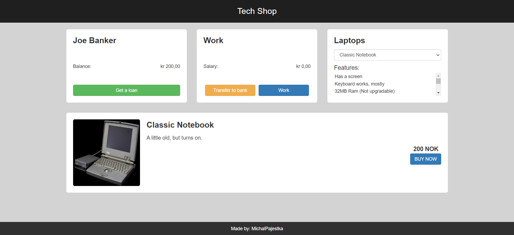

# Tech Shop Challenge

Visit page [here]( https://michalpajestka.github.io/TechShopChallenge/)

## Background

This web page was done according to the requirments of an assignment provided during the Fullstack course at Noroff Accelerate.

## Description

An interactive web page for a Tech Shop, written in HTML, Bootstrap CSS and pure JavaScript. This website has features for financial management, including loan processing, salary management and laptop purchasing.

## Maintainer

[@MichalPajestka](https://github.com/MichalPajestka)

